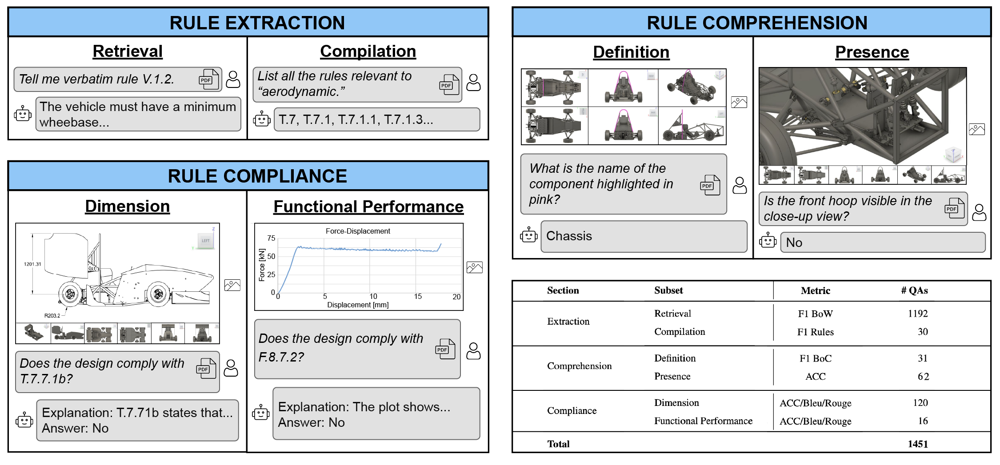

# DesignQA Benchmark

DesignQA: A Multimodal Benchmark for Evaluating Large Language Models' Understanding of Engineering Documentation

Check out the pre-print [here](https://arxiv.org/abs/2404.07917)!

Check out our official website and leaderboard [here](https://design-qa.github.io/)!

## Overview

DesignQA is a novel benchmark aimed at evaluating the proficiency of multimodal large language models (MLLMs) in comprehending and applying engineering requirements in technical documentation. The benchmark is developed in conjunction with the MIT Motorsport team, so that the question-answer pairs are based on real world data and the ~200 page FSAE competition rules. Some key features of the DesignQA benchmark include:

* 1451 question-answer pairs pertaining to design of an FSAE vehicle according to the FSAE competition rules

* 3 benchmark segments - rule extraction, rule comprehension, and rule compliance - that enable fine-grained investigation into a model's strengths and weaknesses when it comes to design according to 

* Automatic evaluation metrics for quick scoring of new MLLMs

* A unique benchmark that requires models to analyze and integrate information from both visual and long-text inputs

Here is a visual overview of the benchmark:



## Dataset
The dataset can be found in the ```dataset``` directory. The dataset is split into three sections: Rule Extraction, Rule Comprehension, and Rule Evaluation. Each dataset section has several different task datasets, which are QAs that can be fed directly to a model for model evaluation. All of these task datasets can be found in the ```dataset``` directory (under their relevant section) and end with ```_qa.csv```. Scripts for dataset generation can be found in the ```scripts``` directory.

## Evaluation
Implementation of existing MLLM model evaluation can be found in the ```eval``` directory.